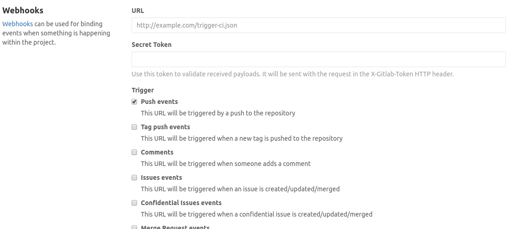

# Guideline For Creating A New Project

Here's a basic checklist I use when creating a new project to make sure it's
easy for people to get started (or when you come back in a couple months time).

For even medium sized projects I would consider all of these points to be
mandatory. Not only do they enforce good practice, but it also makes it **a lot**
easier for new people to start contributing quickly and also gives you the
flexibility to adapt to the project's ever-changing requirements.

I've also tried to add my justification for why each point is necessary, but
feel free to just skip to the dot points at the end of each section if you want.

Links:

* [Make A Good Readme](#Make%20A%20Good%20Readme)
* [Automated Testing](#Automated%20Testing)
* [Version Control and GitHub/GitLab](#Version%20Control%20and%20GitHub%2fGitLab)
* [Testing](#Testing)
* [Continuous Integration](#Continuous%20Integration)

## Make A Good Readme

A README is important. It's usually the first thing people will want to read
when they want to get started, plus it's also what gets shown the moment they
click on your GitHub project. As such, it's a good idea to put a little effort
in.

Here is what I'd consider the bare minimum for a README:

* One liner describing the project and what it does.
* More in-depth description of the project. You could explain the components,
  how it works, why people would use it instead of some alternative, etc.
* How to get a dev environment set up.
* How to get the code, download dependencies, and compile.
* "Hello World" equivalent. This might be as simple as telling them to run
  `$ ./my-binary`, or a basic code snippet if it's a library.
* Documentation. Where is it and how can I generate a local copy?
* Tests. How do you run the test suite?

## Version Control and GitHub/GitLab

It almost goes without saying, **use version control**. Not using version
control is kinda like going through the entire project without saving. Then when
someone wants to make some changes they'll create a copy of this master version,
do their stuff, then afterwards they manually copy/paste in all their changes.

This workflow is fine when there's only one (or maybe two, if you're really
disciplined) people working on a project. However once you throw in multiple
developers and multiple versions of your project this quickly turns into a
massive cluster-fuck and becomes impossible to maintain.

Using version control makes most of these problems go away by using a system
which enforces the discipline for you. Each set of changes is packaged as a
single commit with an associated commit message written by the developer
explaining those changes and the rationale behind them. It also allows you to
track exactly who did what and when.

TODO: Add notes about using GitHub and GitLab for tracking issues, milestones,
etc.

The checklist for this section is pretty short:

* Are you using version control?
* Do you use something like GitHub (for open source projects) or a private
  GitLab (commercial projects) to track issues and manage the repository?

## Testing

There's a common saying in software, *"If it's not tested, it's broken"*. If you
can't prove to yourself that your project works as expected, then it's
effectively just running on dreams and wishful thinking. As such, testing of
some kind is necessary.

Most peoples' first thought is that whenever they change something they'll just
run the program again and manually check everything works as it should. Not only
is this a fairly hands-on process, often requiring you to click through a bunch
of windows or menus to get to the thing you just changed, but you often end up
mindlessly trying different combinations of inputs to ensure all the edge
conditions are covered. Also, don't forget that by changing one thing you could
have created a subtle bug elsewhere in the program, so you should really check
all that too.

As you can imagine, after a couple of these manual testing cycles a normal
human will start to get bored and skip the testing phase, telling themselves
"it's okay, I know what I'm doing so there's no way I could have made a bug".

In reality, checking something using a list of inputs is something computers
excel at. So why spend 10 minutes manually checking something after each change
when you might spend 20 minutes writing a test **once**, then after every change
testing the entire program can be done in a couple hundred milliseconds. The
numbers should speak for themselves.

Automated tests are also invaluable for situations when you may not have
everything you need to do the manual testing. For example, when doing the
telemetry software for CMT we only actually had a working race car in the last
month, and the hardware side of telemetry was only working a couple days before
comp. Without having my automated test suite to ensure everything worked as
expected beforehand, I wouldn't have been able to start until a couple days
before comp, because I would have made the entire system up til then on top of
optimism and wishful thinking.

* Does the project have a test suite?
* Can I run this test suite with a single click of a button (or with a single
  super basic command like `make test`)?
* Does my test suite cover most of the project's use cases?
* Are there unit tests for testing individual chunks of functionality?
* Are there some end-to-end tests which exercise the project in its entirety and
  ensure all the components work together correctly?

## Continuous Integration

CI is cool. It means you'll do a change, push it to your version control, then
that automatically kicks off a server to download your project, build it, and
run your entire test suite. Then if your last commit broke anything it'll let
you know.

If everything passes you can even set things up so that the continuous
integration server will package your project up and create a new release.

> Imagine this scenario; you come into work to find out that there's a new bug.
> You first create a test to reproduce the bug, then write the code to fix it.
> When the test finally passes on your local machine you commit your code and
> push it up to your central repository. Your continuous integration system
> notices the change and runs all your tests against the new code but finds that
> your new fix breaks some existing functionality (for example, it broke a
> Windows-specific feature but you didn't notice because you work on a Mac).
> The CI server immediately sends you an email letting you know what happened,
> you fix the existing feature and then push up the final code. Your CI server
> then runs everything again, finds that nothing is broken, and then automatically
> creates new binaries so that customers can download the fixed version. This
> entire process may have taken a day.
>
> You can see how the effect of using version control, having automated
> tests, and continuous integration combine to give your business a turn around
> time on the order of days instead of waiting on the usual monthly release
> schedule.

The way continuous integration usually works is through web hooks. Put simply,
whenever GitHub or GitLab receive a new commit they can be set up to
automatically send a message to some server. This server then fetches the latest
commit, builds your program, then runs its test suite.

Setting this up is super easy. In GitLab you'll enter the URL of your CI server
and tell it what events to listen for.

As such, the checklist for this section is also a short one:

* Do you have continuous integration set up with GitHub/GitLab?
* Does your CI server run your automated tests on every commit?
* (If Applicable) Does your CI server automatically re-generate your project's
  documentation/
* (Optional) Does your CI server automate the process of pushing new releases?
